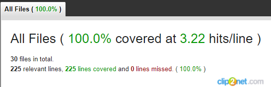

# README
Использованы следующие версии:

**Ruby**  3.2.0 (2022-12-25 revision a528908271)

**Rils** 7.0.4.1

**PostgreSQL** 12.10 (Ubuntu 12.10-0ubuntu0.20.04.1)

Начала работы:
1. Скачиваем репозиторий
2. `bundle install`
3. `EDITOR="mate --wait" bin/rails credentials:edit`
4. Настраиваем config/database.yml (дибо вписываем своего пользователя и пароль, либо добавляем в env DATABASE_USER и DATABASE_PASSWORD)
5. `bundle exec rake db:create`
6. `bundle exec rake db:migrate`
7. Загружаем данные из yml-файла:
    1. для этого создан rake task
    2. `bundle exec rake upload_data_from_yml:upload['db/menu.yml',true]`
    3. первый параметр путь к файлу, второй нужно ли отображать лог.
    4. файл я оставил в директории `db`, так что команду можно не менять.
    
8. `rails s` При условии что все дополнительные сервисы запущены (pg, redis, etc)
9. переходим на главную `http://127.0.0.1:3000/` (если не меняли конфиг пумы)
10. тестируем руками
11. `http://127.0.0.1:3000/ordered_dishes/` endpoint для JSON (как я понял он должен был быть на другом роуте, хотя можно было оставить и на индексе)
12. Так же вне задания добавил еще пару ендпоинтов
    1. `http://127.0.0.1:3000/ordered_dishes/by_date/2023-01-26` для получения блюд от всех заказов за указанную дату в формате ГГГГ-ММ-ДД
    2. `http://127.0.0.1:3000/ordered_dishes/by_id/1` для получения блюд по указанному id заказа
13. Rspec тесты покрывают 100% кода (оставил в директории app папку coverage чтобы глянуть реузльтат)

PS: знаю что есть спорные решения, но я старался исходить из того что указанно в ТЗ и если там не хватало какой то информации, то додумывал ее сам. На митапе я бы сразу задал все интересующие меня вопросы по заданию, но ради тестового не хотел вас беспокоить.

